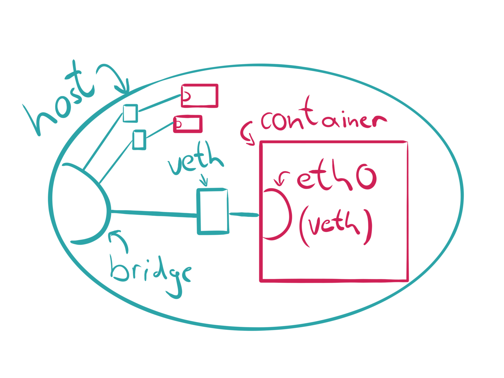

## Table of Contents

- [Introduction](#introduction)
- [chroot](#chroot)
- [Linux Namespaces](#linux-namespaces)
  - [API](#api)
    - [clone](#clone)
    - [unshare](#unshare)
    - [setns](#setns)
    - [proc](#proc)
  - [Available Namespaces](#available-namespaces)
    - [Mount (mnt)](#mount--mnt-)
    - [UNIX Time-sharing System (UTS)](#unix-time-sharing-system--uts-)
    - [Interprocess Communication (IPC)](#interprocess-communication--ipc-)
    - [Process ID (pid)](#process-id--pid-)
    - [Network (net)](#network--net-)
    - [User ID (user)](#user-id--user-)
    - [Control Group (cgroup)](#control-group--cgroup-)
  - [Composing Namespaces](#composing-namespaces)
  - [Demo Application](#demo-application)
- [Putting all Together](#putting-all-together)
- [Conclusion](#conclusion)

## Introduction

If we are talking about containers nowadays, most people tend to think of the
big blue whale or the white steering wheel on the blue background.


Let’s put these thoughts aside and ask ourselves: What are containers in detail?
If we look at the corresponding documentation of Kubernetes we only find
explanations about [“Why to use
containers?“](https://kubernetes.io/docs/concepts/overview/what-is-kubernetes/#why-containers)
and lots of [references to
Docker](https://kubernetes.io/docs/concepts/containers/images/). Docker itself
explains containers as [“a standard unit of
software“](https://www.docker.com/resources/what-container). Their explanations
provide a general overview but do not reveal much of the underlying “magic“.
Eventually, people tend to imagine containers as cheap virtual machines (VMs),
which technically does not come close to the real world. This could be reasoned
since the word “container” does not mean anything precisely at all. The same
applies to the word “pod” in the container orchestration ecosystem.


If we strip it down then containers are only isolated groups of processes
running on a single host, which fulfill a set of “common” features. Some of
these fancy features are built directly into the Linux kernel and mostly all of
them have different historical origins.

So containers have to fulfill four major requirements to be acceptable as such:

1. Not negotiable: They have to run on a single host. Okay, so two computers
   cannot run a single container.
2. Clearly: They are groups of processes. You might know that Linux processes
   live inside a tree structure, so we can say containers must have a root
   process.
3. Okay: They need to be isolated, whatever this means in detail.
4. Not so clear: They have to fulfill common features. Features in general seem
   to change over time, so we have to point out what the most common features
   are.


These requirements alone can lead into confusion and the picture is not clear
yet. So let’s start from the historical beginning to keep things simple.

## chroot

Mostly every UNIX operating system has the possibility to change the root
directory of the current running process (and its children). This originates
from its first occurrence in UNIX Version 7 (released 1979), from where it
continued its journey into the awesome Berkeley Software Distribution (BSD). In
Linux you can nowadays
[`chroot(2)`](http://man7.org/linux/man-pages/man2/chroot.2.html) as system call
(a kernel API function call) or the standalone wrapper program. Chroot is also
referenced as “jail“, because some person used it as a honeypot to monitor a
security hacker back in 1991. So chroot is much older than Linux and it has been
(mis)used in the early 2000s for the first approaches in running applications as
what we would call today “microservices”. Chroot is currently used by a wide
range of applications, for example within build services for different
distributions. Nowadays the BSD implementation differs a lots from the Linux
one, where we will focus on the latter part for now.

What is needed to run an own chroot environment? Not that much, since something
like this already works:

```
> mkdir -p new-root/{bin,lib64}
> cp /bin/bash new-root/bin
> cp /lib64/{ld-linux-x86-64.so*,libc.so*,libdl.so.2,libreadline.so*,libtinfo.so*} new-root/lib64
> sudo chroot new-root
```

We create a new root directory, copy a bash shell and its dependencies in and
run `chroot`. This jail is pretty useless: All we have at hand is bash and its
builtin functions like `cd` and `pwd`.


One might think it could be worth running a statically linked binary in a jail
and that would be the same as running a container image. It’s absolutely not,
and a jail is not really a standalone security feature but more a good addition
to our container world.

The current working directory is left unchanged when calling chroot via a
syscall, whereas relative paths can still refer to files outside of the new
root. This call changes only the root path and nothing else. Beside this,
further calls to chroot do not stack and they will override the current jail.
Only privileged processes with the capability `CAP_SYS_CHROOT` are able to call
chroot. At the end of the day the root user can easily escape from a jail by
running a program like this:

```c
#include <sys/stat.h>
#include <unistd.h>

int main(void)
{
    mkdir(".out", 0755);
    chroot(".out");
    chdir("../../../../../");
    chroot(".");
    return execl("/bin/bash", "-i", NULL);
}
```

We create a new jail by overwriting the current one and change the working
directly to some relative path outside of the chroot environment. Another call
to chroot might bring us outside of the jail which can be verified by spawning a
new interactive bash shell.

To continue with a more useful jail we need an appropriate root file system
(rootfs). This contains all binaries, libraries and the necessary file
structure. But where to get one? What about peeling it from an already existing
Open Container Initiative (OCI) container, which can be easily done with the two
tools [`skopeo`](https://github.com/containers/skopeo) and
[`umoci`](https://github.com/openSUSE/umoci):

```
> skopeo copy docker://opensuse/tumbleweed:latest oci:tumbleweed:latest
[output removed]
> sudo umoci unpack --image tumbleweed:latest bundle
[output removed]
```

Now with our freshly downloaded and extracted rootfs we can chroot into the jail
via:

```
> sudo chroot bundle/rootfs
#
```

It looks like we're running inside a fully working environment, right? But what
did we achieve? We can see that we may sneak-peak outside the jail from a
process perspective:

```
> mkdir /proc
> mount -t proc proc /proc
> ps aux
[output removed]
```

There is no process isolation available at all. We can even kill programs
running outside of the jail, what a metaphor! Let’s peek into the network
devices:

```
> mkdir /sys
> mount -t sysfs sys /sys
> ls /sys/class/net
eth0 lo
```

There is no network isolation, too. This missing isolation paired with the
ability to leave the jail leads into lots of security related concerns, because
jails are sometimes used for wrong (security related) purposes. How to solve
this? This is where the Linux namespaces join the party.

## Linux Namespaces

Namespaces are a Linux kernel feature which were introduced back in 2002 with
Linux 2.4.19. The idea behind a namespace is to wrap certain global system
resources in an abstraction layer. This makes it appear that the processes
within a namespace have their own isolated instance of the resource. The
kernels namespace abstraction allows different groups of processes to have
different views of the system.

Not all available namespaces were implemented from the beginning on. A full
support for what we now understand as “container ready” was finished in kernel
version 3.8 back in 2013 with the introduction of the _user_ namespace. We end
up having currently seven distinct namespaces implemented: _mnt, pid, net, ipc,
uts, user_ and _cgroup_. No worries, we discuss them in detail. In September
2016 two additional namespaces were proposed: _time_ and _syslog_, which are not
fully implemented yet. Let’s have a look into the namespace API before digging
into certain namespaces.

### API

The namespace API of the Linux kernel consists of three main system calls:

#### clone

The [`clone(2)`](http://man7.org/linux/man-pages/man2/clone.2.html) API function
creates a new child process, in a manner similar to
[`fork(2)`](http://man7.org/linux/man-pages/man2/fork.2.html). Unlike `fork(2)`,
the `clone(2)` API allows the child process to share parts of its execution
context with the calling process, such as the memory space, the table of file
descriptors, and the table of signal handlers. You can pass different namespace
flags to `clone(2)` to create new namespaces for the child process.


#### unshare

The function [`unshare(2)`](http://man7.org/linux/man-pages/man2/unshare.2.html)
allows a process to disassociate parts of the execution context which currently
being shared with others.


#### setns

The function [`setns(2)`](http://man7.org/linux/man-pages/man2/setns.2.html)
reassociates the calling thread with the provided namespace file descriptor.
This function can be used to join to an existing namespace. It also helps to
keep a namespace open even if it contains no actual process.


#### proc

Beside the available syscalls, the `proc` filesystem populates additional
namespace related files. Since Linux 3.8, each file in `/proc/$PID/ns` is a
symbolic link which can be used as a handle for performing operations (like
`setns(2)`) to the referenced namespace.

```
> ls -Gg /proc/self/ns/
total 0
lrwxrwxrwx 1 0 Feb  6 18:32 cgroup -> 'cgroup:[4026531835]'
lrwxrwxrwx 1 0 Feb  6 18:32 ipc -> 'ipc:[4026531839]'
lrwxrwxrwx 1 0 Feb  6 18:32 mnt -> 'mnt:[4026531840]'
lrwxrwxrwx 1 0 Feb  6 18:32 net -> 'net:[4026532008]'
lrwxrwxrwx 1 0 Feb  6 18:32 pid -> 'pid:[4026531836]'
lrwxrwxrwx 1 0 Feb  6 18:32 pid_for_children -> 'pid:[4026531836]'
lrwxrwxrwx 1 0 Feb  6 18:32 user -> 'user:[4026531837]'
lrwxrwxrwx 1 0 Feb  6 18:32 uts -> 'uts:[4026531838]'
```

This allows us for example to track in which namespaces certain processes
reside. Another way to play around with namespaces beside the programmatic
approach is using tools from the
[`util-linux`](https://github.com/karelzak/util-linux) package. This contains
dedicated wrapper programs for the mentioned syscalls. One handy tool related to
namespaces within this package is `lsns`. It lists useful information about all
currently accessible namespaces or about a single given one. But now let’s
finally get our hands dirty.

### Available Namespaces

#### Mount (mnt)

The first namespace we want to try out is the mnt namespace, which was the first
implemented one back in 2002. During that time (mostly) nobody thought that
multiple namespaces were ever needed, so they decided to call the namespace
clone flag `CLONE_NEWNS`. This leads into a small inconsistency with other
namespace clone flags (I see you suffering!). With the mnt namespace Linux is
able to isolate a set of mount points by a group of processes.

A great use case of the mnt namespace is to create environments similar to
jails, but in a more secure fashion. How to create such a namespace? This can
easily done via an API function call or the unshare command line tool. So we can
do this:

```
> sudo unshare -m
# mkdir mount-dir
# mount -n -o size=10m -t tmpfs tmpfs mount-dir
# df mount-dir
Filesystem     1K-blocks  Used Available Use% Mounted on
tmpfs              10240     0     10240   0% <PATH>/mount-dir
# touch mount-dir/{0,1,2}
```

Looks like we have a successfully mounted tmpfs, which is not available on the
host system level:

```
> ls mount-dir
> grep mount-dir /proc/mounts
>
```

The actual memory being used for the mount point is laying in an abstraction
layer called Virtual File System (VFS), which is part of the kernel and where
every other filesystem is based on. If the namespace gets destroyed, the mount
memory is unrecoverable lost. The mount namespace abstraction gives us the
possibility to create entire virtual environments in which we are the root user
even without root permissions.

On the host system we are able to see the mount point via the `mountinfo` file
inside of the `proc` filesystem:

```
> grep mount-dir /proc/$(pgrep -u root bash)/mountinfo
349 399 0:84 / /mount-dir rw,relatime - tmpfs tmpfs rw,size=1024k
```

How to work with these mount points on a source code level? Well, programs tend
to keep a file handle on the corresponding `/proc/$PID/ns/mnt` file, which
refers to the used namespace. In the end mount namespace related implementation
scenarios can be really complex, but they give us the power to create flexible
container filesystem trees. The last thing I want to mention is that mounts can
have different flavors (shared, slave, private, unbindable), which is greatly
explained within the shared subtree [documentation of the Linux
kernel](https://www.kernel.org/doc/Documentation/filesystems/sharedsubtree.txt).

#### UNIX Time-sharing System (UTS)

The UTS namespace was introduced in Linux 2.6.19 (2006) and allows us to unshare
the domain- and hostname from the current host system. Let's give it a try:

```
> sudo unshare -m
# hostname
nb
# hostname new-hostname
# hostname
new-hostname
```

And if we look at the system level nothing has changed, hooray:

```
> hostname
nb
```

The UTS namespace is yet another nice addition in containerization, especially
when it comes to container networking related topics.

#### Interprocess Communication (IPC)

IPC namespaces came with Linux 2.6.19 (2006) too and isolate interprocess
communication (IPC) resources. In special these are System V IPC objects and
POSIX message queues. One use case of this namespace would be to separate the
shared memory (SHM) between two processes to avoid misusage. Instead each
process will be able to use the same identifiers for a shared memory region and
produce two distinct regions. When an IPC namespace is destroyed, then all IPC
objects in the namespace are automatically destroyed too.

#### Process ID (pid)

The PID namespace was introduced in Linux 2.6.24 (2008) and gives processes an
independent set of process identifiers (PIDs). This means that processes which
reside in different namespaces can own the same PID. In the end a process has
two PIDs: the PID inside the namespace, and the PID outside the namespace on the
host system. The PID namespaces can be nested, so if a new process is created it
will have a PID for each namespace from its current namespace up to the initial
PID namespace.


The first process created in a PID namespace gets the number 1 and gains all the
same special treatment as the usual init process. For example, all processes
within the namespace are attached to the root PID. This also means that the
termination of this process will immediately terminate all processes in its PID
namespace and any descendants. Let's create a new PID namespace:

```
> sudo unshare -fp --mount-proc
# ps aux
USER       PID %CPU %MEM    VSZ   RSS TTY      STAT START   TIME COMMAND
root         1  0.4  0.6  18688  6608 pts/0    S    23:15   0:00 -bash
root        39  0.0  0.1  35480  1768 pts/0    R+   23:15   0:00 ps aux
```

Looks isolated, doesn't it? The `--mount-proc` flag is needed to re-mount the
proc filesystem from the new namespace. Otherwise we would not see the PID
subtree corresponding to the namespace. Another option would be to manually
mount the proc filesystem via `mount -t proc proc /proc`, but this also
overrides the mount from the host.

#### Network (net)

Network namespaces were completed in Linux 2.6.29 (2009) and can be used to
virtualize the network stack. Each network namespace contains its own resource
properties within `/proc/net`. Furthermore, a network namespace contains only a
loopback interface on initial creation. Let’s create one:

```
> sudo unshare -n
# ip l
1: lo: <LOOPBACK> mtu 65536 qdisc noop state DOWN mode DEFAULT group default qlen 1000
    link/loopback 00:00:00:00:00:00 brd 00:00:00:00:00:00
```

Every network interface (physical or virtual) is present in exactly one
namespace. It is possible that the interface will be moved between namespaces.
Each namespace contains a private set of IP addresses, its own routing table,
socket listing, connection tracking table, firewall, and other network-related
resources.

Destroying a network namespace destroys any virtual interfaces within it and
moves any physical interfaces within it back to the initial network namespace.

A possible use case for the network namespace is creating Software Defined
Networks (SDN) via virtual Ethernet (veth) interface pairs. One end of the
network pair will be plugged into a bridged interface whereas the other end will
be assigned to the target container. This is how pod networks like
[flannel](https://github.com/coreos/flannel) work in general.



Let's see how it works. First, we need to create a new network namespace, which
can be done via `ip`, too:

```
> sudo ip netns add mynet
> sudo ip netns list
mynet
```

So we created a new network namespace called `mynet`. When `ip` creates a
network namespace, it will create a bind mount for it under `/var/run/netns`
too. This allows the namespace to persist even when no processes are running
within it.

With `ip netns exec` we can inspect and manipulate our network namespace even
further:

```
> sudo ip netns exec mynet ip l
1: lo: <LOOPBACK> mtu 65536 qdisc noop state DOWN mode DEFAULT group default qlen 1000
    link/loopback 00:00:00:00:00:00 brd 00:00:00:00:00:00
> sudo ip netns exec mynet ping 127.0.0.1
connect: Network is unreachable
```

The network seems down, lets bring it up:

```
> sudo ip netns exec mynet ip link set dev lo up
> sudo ip netns exec mynet ping 127.0.0.1
PING 127.0.0.1 (127.0.0.1) 56(84) bytes of data.
64 bytes from 127.0.0.1: icmp_seq=1 ttl=64 time=0.016 ms
```

Hooray! Now let's create a veth pair which should allow communication later on:

```
> sudo ip link add veth0 type veth peer name veth1
> sudo ip link show type veth
11: veth1@veth0: <BROADCAST,MULTICAST,M-DOWN> mtu 1500 qdisc noop state DOWN mode DEFAULT group default qlen 1000
    link/ether b2:d1:fc:31:9c:d3 brd ff:ff:ff:ff:ff:ff
12: veth0@veth1: <BROADCAST,MULTICAST,M-DOWN> mtu 1500 qdisc noop state DOWN mode DEFAULT group default qlen 1000
    link/ether ca:0f:37:18:76:52 brd ff:ff:ff:ff:ff:ff
```

Both interfaces are automatically connected, which means that packets sent to
`veth0` will be received by `veth1` and vice versa. Now we associate one end of
the veth pair to our network namespace:

```
> sudo ip link set veth1 netns mynet
> ip link show type veth
12: veth0@if11: <BROADCAST,MULTICAST> mtu 1500 qdisc noop state DOWN mode DEFAULT group default qlen 1000
    link/ether ca:0f:37:18:76:52 brd ff:ff:ff:ff:ff:ff link-netns mynet
```

Our network interfaces need some addresses for sure:

```
> sudo ip netns exec mynet ip addr add 172.2.0.1/24 dev veth1
> sudo ip netns exec mynet ip link set dev veth1 up
> sudo ip addr add 172.2.0.2/24 dev veth0
> sudo ip link set dev veth0 up
```

Communicating in both directions should now be possible:

```
> ping -c1 172.2.0.1
PING 172.2.0.1 (172.2.0.1) 56(84) bytes of data.
64 bytes from 172.2.0.1: icmp_seq=1 ttl=64 time=0.036 ms

--- 172.2.0.1 ping statistics ---
1 packets transmitted, 1 received, 0% packet loss, time 0ms
rtt min/avg/max/mdev = 0.036/0.036/0.036/0.000 ms
> sudo ip netns exec mynet ping -c1 172.2.0.2
PING 172.2.0.2 (172.2.0.2) 56(84) bytes of data.
64 bytes from 172.2.0.2: icmp_seq=1 ttl=64 time=0.020 ms

--- 172.2.0.2 ping statistics ---
1 packets transmitted, 1 received, 0% packet loss, time 0ms
rtt min/avg/max/mdev = 0.020/0.020/0.020/0.000 ms
```

It works, but we wouldn't have any internet access from the network namespace.
We would need a network bridge or something similar for that and a default route
from the namespace. I leave this task up to you, for now let’s go on to the next
namespace.

#### User ID (user)

With Linux 3.5 (2012) the isolation of user and group IDs was finally possible
via namespaces. Linux 3.8 (2013) made it possible to create user namespaces even
without being actually privileged. The user namespace enables that a user and
group IDs of a process can be different inside and outside of the namespace. An
interesting use-case is that a process can have a normal unprivileged user ID
outside a user namespace while being fully privileged inside.

Let's give it a try:

```
> id -u
1000
> unshare -U
> whoami
nobody
```

After the namespace creation, the files `/proc/$PID/{u,g}id_map` expose the
mappings for user and group IDs for the PID. These files can be written only
once to define the mappings.

In general each line within these files contain a one to one mapping of a range
of contiguous user IDs between two user namespaces:

```
> cat /proc/self/uid_map
         0          0 4294967295
```

The example above translates to: With the starting user ID 0 the namespace maps
to a range starting at ID 0, too. For the most parent user namespace this should
be true, and applied to all `2^32 - 1` available IDs.

If now a process tries to access a file, its user and group IDs are mapped into
the initial user namespace for the purpose of permission checking. When a
process retrieves file user and group IDs (via
[`stat(2)`](http://man7.org/linux/man-pages/man2/fstat.2.html)), the IDs are
mapped in the opposite direction.

In the unshare example above we call
[`getuid(2)`](http://man7.org/linux/man-pages/man2/getuid.2.html) before writing
a appropriate user mapping, which will result in an unmapped ID. This unmapped
ID is automatically converted to the overflow user ID (65534 or the value in `/proc/sys/kernel/overflow{g,u}id`).

In the end the user namespace enables great security additions to the container
world.

#### Control Group (cgroup)

Croups started their journey 2008 with Linux 2.6.24 as dedicated Linux kernel
feature. The main goal of cgroups is to support resource limiting,
prioritization, accounting and controlling. A major redesign started in 2013,
whereas the cgroup namespace was added with Linux 4.6 (2016) to prevent leaking
host information to a namespace. The second version of cgroups were released
there too and major features were added since then. One example is an out of
memory (OOM) killer which adds an ability to kill a cgroup as a single unit to
guarantee the integrity of the workload.

Let’s play around with them and create a new cgroup. By default the kernel
exposes cgroups in `/sys/fs/cgroup`. To create a new cgroup, we simple create a
new sub-directoy in that location:

```
> sudo mkdir /sys/fs/cgroup/memory/demo
> ls /sys/fs/cgroup/memory/demo
cgroup.clone_children
cgroup.event_control
cgroup.procs
memory.failcnt
memory.force_empty
memory.kmem.failcnt
memory.kmem.limit_in_bytes
memory.kmem.max_usage_in_bytes
memory.kmem.slabinfo
memory.kmem.tcp.failcnt
memory.kmem.tcp.limit_in_bytes
memory.kmem.tcp.max_usage_in_bytes
memory.kmem.tcp.usage_in_bytes
memory.kmem.usage_in_bytes
memory.limit_in_bytes
memory.max_usage_in_bytes
memory.move_charge_at_immigrate
memory.numa_stat
memory.oom_control
memory.pressure_level
memory.soft_limit_in_bytes
memory.stat
memory.swappiness
memory.usage_in_bytes
memory.use_hierarchy
notify_on_release
tasks
```

You can see that there already some default values exposed there. Now we are
able to set the memory limits for that cgroup. We are also turning off swap to
make our example implementation work.

```
> sudo su
# echo 100000000 > /sys/fs/cgroup/memory/demo/memory.limit_in_bytes
# echo 0 > /sys/fs/cgroup/memory/demo/memory.swappiness
```

To assign a process to a cgroup we can write the corresponding PID to the
`tasks` file:

```
# echo $$ > /sys/fs/cgroup/memory/demo/tasks
```

Now we can write a sample application to consume more than the allowed 100MB of
memory:

```rust
pub fn main() {
    let mut vec = vec![];
    loop {
        vec.extend_from_slice(&[1u8; 10_000_000]);
        println!("{}0 MB", vec.len() / 10_000_000);
    }
}
```

If we run the program, we see that the PID will be killed because of the set
memory constraints. So our host system is still usable.

```
# ./memory
10 MB
20 MB
30 MB
40 MB
50 MB
60 MB
70 MB
80 MB
90 MB
Killed
```

### Composing Namespaces

Namespaces are composable, too! This makes it possible to have isolated pid
namespaces in Kubernetes Pods which share the same network interface.

To demonstrate this, let’s create a new namespace with an isolated PID:

```
> sudo unshare -fp --mount-proc
# ps aux
USER       PID %CPU %MEM    VSZ   RSS TTY      STAT START   TIME COMMAND
root         1  0.1  0.6  18688  6904 pts/0    S    23:36   0:00 -bash
root        39  0.0  0.1  35480  1836 pts/0    R+   23:36   0:00 ps aux
```

The `setns(2)` syscall with its appropriate wrapper program `nsenter` can now be
used to join the namespace. For this we have to find out which namespace we want
to join:

```
> export PID=$(pgrep -u root bash)
> sudo ls -l /proc/$PID/ns
```

Now it is easily possible to join the namespace via `nsenter`:

```
> sudo nsenter --pid=/proc/$PID/ns/pid unshare --mount-proc
# ps aux
root         1  0.1  0.0  10804  8840 pts/1    S+   14:25   0:00 -bash
root        48  3.9  0.0  10804  8796 pts/3    S    14:26   0:00 -bash
root        88  0.0  0.0   7700  3760 pts/3    R+   14:26   0:00 ps aux
```

We can now see that we are member of the same PID namespace! It is also possible
to enter already running containers via `nsenter`, but this topic will be
covered later on.

### Demo Application

A small demo application can be used to create a simple isolated environment via
the namespace API:

```c
#define _GNU_SOURCE
#include <errno.h>
#include <sched.h>
#include <stdio.h>
#include <string.h>
#include <sys/mount.h>
#include <sys/msg.h>
#include <sys/stat.h>
#include <sys/types.h>
#include <sys/wait.h>
#include <unistd.h>

#define STACKSIZE (1024 * 1024)
static char stack[STACKSIZE];

void print_err(char const * const reason)
{
    fprintf(stderr, "Error %s: %s\n", reason, strerror(errno));
}

int exec(void * args)
{
    // Remount proc
    if (mount("proc", "/proc", "proc", 0, "") != 0) {
        print_err("mounting proc");
        return 1;
    }

    // Set a new hostname
    char const * const hostname = "new-hostname";
    if (sethostname(hostname, strlen(hostname)) != 0) {
        print_err("setting hostname");
        return 1;
    }

    // Create a message queue
    key_t key = {0};
    if (msgget(key, IPC_CREAT) == -1) {
        print_err("creating message queue");
        return 1;
    }

    // Execute the given command
    char ** const argv = args;
    if (execvp(argv[0], argv) != 0) {
        print_err("executing command");
        return 1;
    }

    return 0;
}

int main(int argc, char ** argv)
{
    // Provide some feedback about the usage
    if (argc < 2) {
        fprintf(stderr, "No command specified\n");
        return 1;
    }

    // Namespace flags
    const int flags = CLONE_NEWNET | CLONE_NEWUTS | CLONE_NEWNS | CLONE_NEWIPC |
                      CLONE_NEWPID | CLONE_NEWUSER | SIGCHLD;

    // Create a new child process
    pid_t pid = clone(exec, stack + STACKSIZE, flags, &argv[1]);

    if (pid < 0) {
        print_err("calling clone");
        return 1;
    }

    // Wait for the process to finish
    int status = 0;
    if (waitpid(pid, &status, 0) == -1) {
        print_err("waiting for pid");
        return 1;
    }

    // Return the exit code
    return WEXITSTATUS(status);
}
```

Purpose of the application is to spawn a new child process in different
namespaces. Every command provided to the executable will be forwarded to the
child process. The application terminates, when the command execution is done.
You can now test an verify the implementation via:

```
> gcc -o namespaces namespaces.c
> ./namespaces ip a
1: lo: <LOOPBACK> mtu 65536 qdisc noop state DOWN group default qlen 1000
    link/loopback 00:00:00:00:00:00 brd 00:00:00:00:00:00
> ./namespaces ps aux
USER       PID %CPU %MEM    VSZ   RSS TTY      STAT START   TIME COMMAND
nobody       1  0.0  0.1  36524  1828 pts/0    R+   23:46   0:00 ps aux
> ./namespaces whoami
nobody
```

Feel free to use this as a starting point for your own little experiments with
the namespace API.

## Putting all Together

Do you remember the rootfs we extracted from the image within the chroot
section? We can use a low level container runtime like
[`runc`](https://github.com/opencontainers/runc) to easily run a container from
the rootfs:

```
> sudo runc run -b bundle container
```

If we now inspect the system namespaces, we see that `runc` already created mnt,
uts, ipc, pid and net for us:

```
> sudo lsns | grep bash
4026532499 mnt         1  6409 root   /bin/bash
4026532500 uts         1  6409 root   /bin/bash
4026532504 ipc         1  6409 root   /bin/bash
4026532505 pid         1  6409 root   /bin/bash
4026532511 net         1  6409 root   /bin/bash
```

I will stop here and we will learn more about container runtimes in upcoming
blog posts and talks.

## Conclusion

I really hope you’d enjoyed the read and that the mysteries about containers are
now a little bit more fathomable. If you run Linux it is easy to play around
with different isolation techniques from scratch. In the end a container runtime
nicely uses all these isolation features to provide a stable and robust
development and production platform for containers.

There are a lots of topics which were not covered here because I wanted to stay
at a stable level of detail. For sure, a great resource for digging deeper into
the topic of Linux namespaces is the Linux programmers manual:
[`NAMESPACES(7)`](http://man7.org/linux/man-pages/man7/namespaces.7.html).

Feel free to drop me a line or get in contact with me for any questions or
feedback. The next blog posts will cover container runtimes, security and the
overallecosystem around latest container technologies. Stay tuned!
