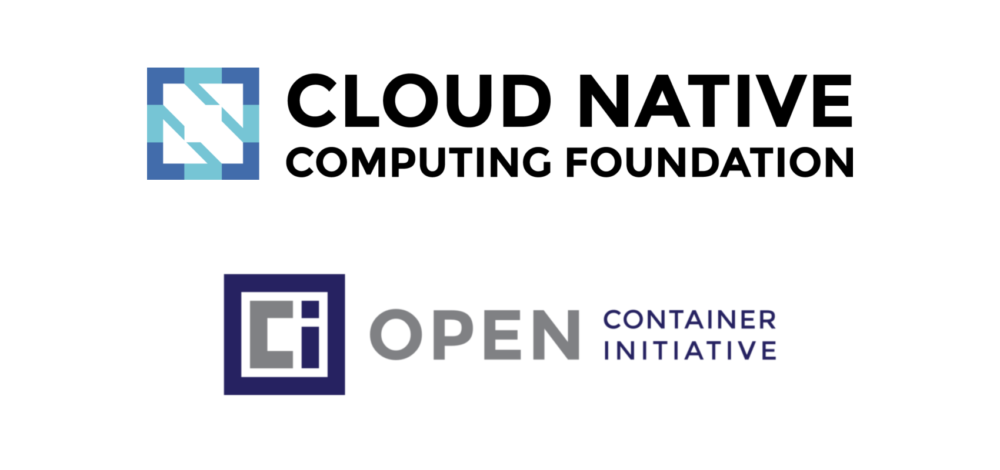

## Table of Contents

- [Introduction](#introduction)
- [What is a Container Runtime?](#what-is-a-container-runtime-)
- [A Brief History](#a-brief-history)
- [Running Containers](#running-containers)
  - [runc](#runc)
  - [The Kubernetes Container Runtime Interface (CRI)](#the-kubernetes-container-runtime-interface-cri-)
  - [CRI-O](#cri-o)
- [Conclusion](#conclusion)

## Introduction

In the [previous part](../part1-kernel-space/post.md) of this series we
discussed Linux Kernel Namespaces and everything around to build up a foundation
about containers and their basic isolation techniques. Now we want to dive
deeper into answering the question: “How to actually run containers?”. We
will do so without being overwhelmed by the details of Kubernetes’ features or
security related topics, which will be part of further blog posts and talks.

## What is a Container Runtime?

Applications and their required or not required use cases are contentiously
discussed topics in the UNIX world. The main
[UNIX philosophy](https://en.wikipedia.org/wiki/Unix_philosophy)
propagates minimalism and modular software parts which should fit well together
in a complete system. Great examples which follow these philosophical aspects
are features like the
[UNIX pipe](<https://en.wikipedia.org/wiki/Pipeline_(Unix)>) or text editors
like [vim](https://www.vim.org). These tools solve one dedicated task as best as
they can and are tremendously successful at it. On the other side, there are
projects like [systemd](https://en.wikipedia.org/wiki/Systemd) or
[cmake](https://cmake.org), which do not follow the same approach and implement
a richer feature set over time. In the end we have multiple views
and opinions about answers to questions like _”How should an initialization
system look like?”_ or _”What should a build system do?”_. If these
multi-opinionated views mix up with historical events, then answering a simple
question might need more explanations than it should.

_Now, welcome to the world of containers!_

Lots of applications can run containers, whereas every application would have
a sightly different opinion about what a container runtime should do and
support. For example, systemd is able to run containers via
[systemd-nspawn](https://www.freedesktop.org/software/systemd/man/systemd-nspawn.html),
and [NixOS](https://nixos.org) has integrated
[container management](https://nixos.org/nixos/manual/#ch-containers) as well. Not
to mention all the other existing container runtimes like
[CRI-O](https://cri-o.io),
[Kata Containers](https://katacontainers.io),
[Firecracker](https://firecracker-microvm.github.io),
[gVisor](https://github.com/google/gvisor),
[containerd](https://containerd.io),
[LXC](https://linuxcontainers.org),
[runc](https://github.com/opencontainers/runc),
[Nabla Containers](https://nabla-containers.github.io) and many more. A lot of
them are now part of the
[Cloud Native Computing Foundation (CNCF)](https://www.cncf.io) and their
[huge landscape](https://landscape.cncf.io), whereas someone might ask:
_”Why do so many container runtimes exist?”_.


Per usual for our series of blog posts, we should start from the historical
beginning.

## A Brief History

After the invention of cgroups back in 2008, a project called _Linux
Containers_ (LXC) started to pop-up in the wild, which should revolutionize the
container world. LXC combined cgroup and namespace technologies to provide an
isolated environment for running applications. You may know that we sometimes
live in a parallel world. This means that Google started their own
containerization project in 2007 called _Let Me Contain That For You_
([LMCTFY](https://github.com/google/lmctfy)), which works mainly at the same
level as LXC does. With LMCTFY, Google tried to provide a stable and API driven
configuration without users having to understand the details of cgroups
and its internals.

If we now look back into 2013 we see that there was a tool written called
_Docker_, which was built on top of the already existing LXC stack. One
invention of Docker was that the user is now able to package containers into
images to move them between machines. Docker were the first ones who tried to
make containers a standard software unit, as they state in their [”Standard
Container Manifesto”](https://github.com/moby/moby/blob/0db56e6c519b19ec16c6fbd12e3cee7dfa6018c5/README.md).

Some years later they began to work on
[libcontainer](https://github.com/docker/libcontainer), a
[Go](https://golang.org/) native way to spawn and manage containers. LMCTFY
was abandoned during that time too, whereas the core concepts and major benefits
of LMCTFY were ported into libcontainer and Docker.

We are now back in 2015, where projects like Kubernetes hit version 1.0. A lot
of stuff was ongoing during that time: The CNCF was founded as part of the
[Linux Foundation](https://www.linuxfoundation.org) with the target to promote
containers. The [Open Container Initiative
(OCI)](https://www.opencontainers.org) was founded 2015 as well, as an open
governance structure around the container ecosystem.



Their main target is to create open industry standards around container formats
and runtimes. We were now in a state where containers are used, in terms of
their popularity, side by side with classic Virtual Machines (VMs). There was a
need for a specification of how containers should run, which resulted in the
[OCI Runtime Specification](https://github.com/opencontainers/runtime-spec).
Runtime developers should now be able to have a well-defined API to develop
their container runtime. The libcontainer project was donated to the OCI during
that time, whereas a new tool called runc was born as part of that. With runc it
was now possible to directly interact with libcontainer, interpret the OCI
Runtime Specification and run containers from it.

As of today, runc is one of the most popular projects in the container ecosystem
and is used in a lot of other projects like containerd (used by Docker), CRI-O
and [podman](https://podman.io). Other projects adopted the OCI Runtime
Specification as well. For example Kata Containers makes it possible to build
and run secure containers including lightweight virtual machines that feel and
perform like containers, but provide stronger workload isolation using hardware
virtualization technology as a second layer of defense.

Let’s dig more into the OCI Runtime Specification to get a better understanding
about how a container runtime works under the hood.

## Running Containers

### runc


The OCI Runtime Specification provides information about the configuration,
execution environment and overall life cycle of a container. A configuration is
mainly a [JSON](https://www.json.org) file that contains all necessary
information to enable the creation of a container on different target platforms
like Linux, Windows or Virtual Machines (VMs).

An example specification can be easily generated with runc:

```bash
> runc spec
> cat config.json
```

```json
{
  "ociVersion": "1.0.0",
  "process": {
    "terminal": true,
    "user": { "uid": 0, "gid": 0 },
    "args": ["sh"],
    "env": [
      "PATH=/usr/local/sbin:/usr/local/bin:/usr/sbin:/usr/bin:/sbin:/bin",
      "TERM=xterm"
    ],
    "cwd": "/",
    "capabilities": {
      "bounding": ["CAP_AUDIT_WRITE", "CAP_KILL", "CAP_NET_BIND_SERVICE"],
      [...]
    },
    "rlimits": [ { "type": "RLIMIT_NOFILE", "hard": 1024, "soft": 1024 } ],
    "noNewPrivileges": true
  },
  "root": { "path": "rootfs", "readonly": true },
  "hostname": "runc",
  "mounts": [
    {
      "destination": "/proc",
      "type": "proc",
      "source": "proc"
    },
    [...]
  ],
  "linux": {
    "resources": { "devices": [ { "allow": false, "access": "rwm" } ] },
    "namespaces": [
      { "type": "pid" },
      { "type": "network" },
      { "type": "ipc" },
      { "type": "uts" },
      { "type": "mount" }
    ],
    "maskedPaths": [
      "/proc/kcore",
      [...]
    ],
    "readonlyPaths": [
      "/proc/asound",
      [...]
    ]
  }
}
```

This file mainly contains all necessary information for runc to get started with
running containers. For example, we have attributes about the running process,
the defined environment variables, the user and group IDs, needed mount points
and the Linux namespaces to be set up. One thing is still missing to get started
running containers: We need an appropriate root file-system (rootfs). We already
discovered in the past blog post how to obtain it from an already existing
container image:

```bash
> skopeo copy docker://opensuse/tumbleweed:latest oci:tumbleweed:latest
[output removed]
> sudo umoci unpack --image tumbleweed:latest bundle
[output removed]
```

Interestingly, the unpacked container image already includes the Runtime
Specification we need to run the bundle:

```bash
> sudo chown -R $(id -u) bundle
> cat bundle/config.json
```

```json
{
  "ociVersion": "1.0.0",
  "process": {
    "terminal": true,
    "user": { "uid": 0, "gid": 0 },
    "args": ["/bin/bash"],
    "env": [
      "PATH=/usr/local/sbin:/usr/local/bin:/usr/sbin:/usr/bin:/sbin:/bin",
      "TERM=xterm",
      "HOME=/root"
    ],
    "cwd": "/",
    "capabilities": { [...] },
    "rlimits": [...]
  },
  "root": { "path": "rootfs" },
  "hostname": "mrsdalloway",
  "mounts": [...],
  "annotations": {
    "org.opencontainers.image.title": "openSUSE Tumbleweed Base Container",
    "org.opencontainers.image.url": "https://www.opensuse.org/",
    "org.opencontainers.image.vendor": "openSUSE Project",
    "org.opencontainers.image.version": "20190517.6.190",
    [...]
  },
  "linux": {
    "resources": { "devices": [ { "allow": false, "access": "rwm" } ] },
    "namespaces": [
      { "type": "pid" },
      { "type": "network" },
      { "type": "ipc" },
      { "type": "uts" },
      { "type": "mount" }
    ]
  }
}
```

There are now some `annotations` included beside the usual fields we already
know from running `runc spec`. These can be used to add arbitrary metadata to
the container, which can be utilized by higher level runtimes to add additional
information to the specification.

Let’s create a new container from the bundle with runc. Before actually calling
out to runc, we have to setup a receiver terminal to be able to interact with
the container. For this, we can use the
[recvtty](https://github.com/opencontainers/runc/blob/master/contrib/cmd/recvtty/recvtty.go)
tool included in the runc repository:

```bash
> go get github.com/opencontainers/runc/contrib/cmd/recvtty
> recvtty tty.sock
```

In another terminal, we now call `runc create` with specifying the bundle and
terminal socket:

```bash
> sudo runc create -b bundle --console-socket $(pwd)/tty.sock container
```

No further output, so what happened now? It seems like we have created a new
container in `created` state:

```bash
> sudo runc list
ID          PID         STATUS      BUNDLE      CREATED                          OWNER
container   29772       created     /bundle     2019-05-21T08:35:51.382141418Z   root
```

The container seems to be not running, but what is running inside?

```bash
> sudo runc ps container
UID        PID  PPID  C STIME TTY          TIME CMD
root     29772     1  0 10:35 ?        00:00:00 runc init
```

The `runc init` command sets up a fresh environment with all necessary
namespaces and launches a new initial process. The main process `/bin/bash` does
not run yet inside the container, but we are still able to execute further
processes within the container:

```bash
> sudo runc exec -t container echo "Hello, world!"
> Hello, world!
```

The `created` state of a container provides a nice environment to setup
networking for example. To actually do something within the container, we have
to bring it into the `running` state. This can be done via `runc start`:

```bash
> sudo runc start container
```

In the terminal where the `recvtty` process is running, a new
bash shell session should now pop up:

```bash
mrsdalloway:/ $
mrsdalloway:/ $ ps aux
ps aux
USER       PID %CPU %MEM    VSZ   RSS TTY      STAT START   TIME COMMAND
root         1  0.0  0.0   5156  4504 pts/0    Ss   10:28   0:00 /bin/bash
root        29  0.0  0.0   6528  3372 pts/0    R+   10:32   0:00 ps aux
```

Nice, the container seems to be running. We can now utilize `runc` to inspect
the container’s state:

```bash
> sudo runc list
ID          PID         STATUS      BUNDLE      CREATED                          OWNER
container   4985        running     /bundle     2019-05-20T12:14:14.232015447Z   root
```

```bash
> sudo runc ps container
UID        PID  PPID  C STIME TTY          TIME CMD
root      6521  6511  0 14:25 pts/0    00:00:00 /bin/bash
```

The `runc init` process has gone and now only the actual `/bin/bash` process
exists within the container. We can also do some basic life cycle management
with the container:

```bash
> sudo runc pause container
```

It should now be impossible to get any output from the running container in the
`recvtty` session. To resume the container, simply call:

```bash
> sudo runc resume container
```

Everything we tried to type before should now pop up in the resumed container
terminal. If we need more information about the container, like the CPU and
memory usage, then we can retrieve them via the `runc events` API:

```bash
> sudo runc events container
{...}
```

The output is a bit hard to read, so let’s reformat it and strip some fields:

```json
{
  "type": "stats",
  "id": "container",
  "data": {
    "cpu": {
      "usage": {
        "total": 31442016,
        "percpu": [ 5133429, 5848165, 827530, ... ],
        "kernel": 20000000,
        "user": 0
      },
      "throttling": {}
    },
    "memory": {
      "usage": {
        "limit": 9223372036854771712,
        "usage": 1875968,
        "max": 6500352,
        "failcnt": 0
      },
      "swap": { "limit": 0, "failcnt": 0 },
      "kernel": {
        "limit": 9223372036854771712,
        "usage": 311296,
        "max": 901120,
        "failcnt": 0
      },
      "kernelTCP": { "limit": 9223372036854771712, "failcnt": 0 },
      "raw": {
        "active_anon": 1564672,
        [...]
      }
    },
    "pids": { "current": 1 },
    "blkio": {},
    "hugetlb": { "1GB": { "failcnt": 0 }, "2MB": { "failcnt": 0 } },
    "intel_rdt": {}
  }
}
```

We can see that we are able to retrieve detailed runtime information about the
container.

To stop the container, we simply exit the `recvtty` session. Afterwards the
container can be removed with `runc delete`:

```bash
> sudo runc list
ID          PID         STATUS      BUNDLE      CREATED                         OWNER
container   0           stopped     /bundle     2019-05-21T10:28:32.765888075Z  root
> sudo runc delete container
> sudo runc list
ID          PID         STATUS      BUNDLE      CREATED     OWNER
```

Containers in the `stopped` state cannot run again, so they have to be recreated
from a fresh state. As already mentioned, the extracted bundle contains the
necessary `config.json` file beside the rootfs, which will be used by runc to
setup the container. We could for example modify the initial run command of the
container by executing:

```bash
> cd bundle
> jq '.process.args = ["echo", "Hello, world!"]' config.json | sponge config.json
> sudo runc run container
> Hello, world!
```

We have nearly every freedom by editing the rootfs or the `config.json`. So we
could tear down the PID namespace isolation between the container and the host:

```bash
> jq '.process.args = ["ps", "a"] | del(.linux.namespaces[0])' config.json | sponge config.json
> sudo runc run container
16583 ?        S+     0:00 sudo runc run container
16584 ?        Sl+    0:00 runc run container
16594 pts/0    Rs+    0:00 ps a
[output truncated]
```

In the end runc is a pretty low level runtime, whereas improper configuration
and usage can lead into serious security concerns. Truly, runc has native
support for security enhancements like
[seccomp](https://en.wikipedia.org/wiki/Seccomp), [Security-Enhanced Linux
(SELinux)](https://en.wikipedia.org/wiki/Security-Enhanced_Linux) and
[AppArmor](https://en.wikipedia.org/wiki/AppArmor) but these features should be
used by higher level runtimes to ensure correct usage in production. It is also
worth mentioning that it is possible to run containers in rootless mode via runc
to security harden the deployment even further. We will cover these topics in
future blog posts as well, but for now that should suffice on that level.

Another drawback in running containers only with runc would be that we have to
manually set up the networking to the host to reach out to the internet or other
containers. In order to do that we could use the
[Runtime Specification Hooks](https://github.com/opencontainers/runtime-spec/blob/master/config.md#posix-platform-hooks)
feature to set up a default bridge before actually starting the container.

But why don’t we leave this job to a higher level runtime as well? Let’s go for
that and move on.

### The Kubernetes Container Runtime Interface (CRI)

Back in 2016, the Kubernetes project announced the implementation of the
[Container Runtime Interface (CRI)](https://kubernetes.io/blog/2016/12/container-runtime-interface-cri-in-kubernetes),
which provides a standard API for container runtimes to work with Kubernetes.
This interface enables users to exchange the runtime in a cluster with ease.

How does the API work? At the bottom line of every Kubernetes cluster runs a
piece of software called the _kubelet_, which has the main job of keeping
container workloads running and healthy. The kubelet connects to a
[gRPC](https://www.grpc.io) server on startup and expects a predefined API
there. For example, some service definitions of the API look like this:

```protobuf
// Runtime service defines the public APIs for remote container runtimes
service RuntimeService {
    rpc CreateContainer (...) returns (...) {}
    rpc ListContainers  (...) returns (...) {}
    rpc RemoveContainer (...) returns (...) {}
    rpc StartContainer  (...) returns (...) {}
    rpc StopContainer   (...) returns (...) {}
```

That seems to be pretty much what we already did with runc, managing the
container life cycle. If we look further at the API, we see this:

```protobuf
    rpc ListPodSandbox  (...) returns (...) {}
    rpc RemovePodSandbox(...) returns (...) {}
    rpc RunPodSandbox   (...) returns (...) {}
    rpc StopPodSandbox  (...) returns (...) {}
}
```

What does “sandbox” mean? Containers should already be some kind of sandbox,
right? Yes, but in the Kubernetes world
[Pods](https://kubernetes.io/docs/concepts/workloads/pods/pod) can consist of
multiple containers, whereas this abstract hierarchy has to be mapped into a
simple list of containers. Because of that, every creation of a Kubernetes Pod
starts with the setup of a so called _PodSandbox_. Every container running
inside the Pod is attached to this sandbox, so the containers inside can share
common resources, like their network interfaces for example. runc alone does not
provide such features out of the box, so we have to use a higher level runtime
to achieve our goal.

### CRI-O


CRI-O is a higher level container runtime which has been written on purpose to
be used with the Kubernetes CRI. The name originates from the combination of the
Container Runtime Interface and the Open Container Initiative. Isn't that
simple? CRI-O’s journey started as Kubernetes incubator project back in 2016
under the name _Open Container Initiative Daemon_ (OCID). Version 1.0.0 has been
released one year later in 2017 and follows the Kubernetes release cycles from
that day on. This means for example, that the Kubernetes version 1.15 can be
safely used together with CRI-O 1.15 and so on.

The implementation of CRI-O follows the main UNIX philosophy and tends to be a
lightweight alternative to Docker or containerd when it comes to running
production-ready workloads inside of Kubernetes. It is not meant to be a
developers-facing tool which can be used from the command line. CRI-O has only
one major task: Fulfilling the Kubernetes CRI. To achieve that, it utilizes runc
for basic container management in the back, whereas the gRPC server provides the
API in the front end. Everything in between is done either by CRI-O itself or by
core libraries like [containers/storage](https://github.com/containers/storage)
or [containers/image](https://github.com/containers/image). But in the end it
doesn’t mean that we cannot play around with it, so let’s give it a try.

I prepared a container image called
[“crio-playground”](https://hub.docker.com/r/saschagrunert/crio-playground) to
get started with CRI-O in an efficient manner. This image contains all necessary
tools, example files and a working CRI-O instance running in the background. To
start a privileged container running the crio-playground, simply execute:

```bash
> sudo podman run --privileged -h crio-playground -it saschagrunert/crio-playground
crio-playground:~ $
```

From now on we will use a tool called
[crictl](https://github.com/kubernetes-sigs/cri-tools) to interface with CRI-O
and its Container Runtime Interface implementation. crictl allows us to use
[YAML](https://yaml.org) representations of the CRI API requests to send them
to CRI-O. For example, we can create a new PodSandbox with the `sandbox.yml`
lying around in the current working directory of the playground:

```yaml
metadata:
  name: sandbox
  namespace: default
dns_config:
  servers:
    - 8.8.8.8
```

To create the sandbox in the running crio-playground container, we now
execute:

```bash
crio-playground:~ $ crictl runp sandbox.yml
5f2b94f74b28c092021ad8eeae4903ada4b1ef306adf5eaa0e985672363d6336
```

Let’s store the identifier of the sandbox as `$POD_ID` environment variable for
later usage as well:

```bash
crio-playground:~ $ export POD_ID=5f2b94f74b28c092021ad8eeae4903ada4b1ef306adf5eaa0e985672363d6336
```

If we now run `crictl pods` we can see that we finally have one PodSandbox up
and running:

```bash
crio-playground:~ $ crictl pods
POD ID              CREATED             STATE               NAME                NAMESPACE           ATTEMPT
5f2b94f74b28c       43 seconds ago      Ready               sandbox             default             0
```

But what's inside our sandbox? We surely can examine the sandbox further by
using runc:

```bash
crio-playground:~ $ runc list
ID                                                                 PID         STATUS      BUNDLE                                                                                                             CREATED                          OWNER
5f2b94f74b28c092021ad8eeae4903ada4b1ef306adf5eaa0e985672363d6336   80          running     /run/containers/storage/vfs-containers/5f2b94f74b28c092021ad8eeae4903ada4b1ef306adf5eaa0e985672363d6336/userdata   2019-05-23T13:43:38.798531426Z   root
```

The sandbox seems to run in a dedicated bundle under `/run/containers`.

```bash
crio-playground:~ $ runc ps $POD_ID
UID        PID  PPID  C STIME TTY          TIME CMD
root        80    68  0 13:43 ?        00:00:00 /pause
```

Interestingly, there is only one process running inside the sandbox, called
`pause`. As [the source code of pause
indicates](https://github.com/kubernetes/kubernetes/blob/4665303/build/pause/pause.c),
the main task of this process is to keep the environment running and react to
incoming signals. Before we actually create our workload within that sandbox, we
have to pre-pull the image we want to run. A trivial example would be to run a
web server, so let’s retrieve a nginx image by calling:

```bash
crio-playground:~ $ crictl pull nginx:alpine
Image is up to date for docker.io/library/nginx@sha256:0fd68ec4b64b8dbb2bef1f1a5de9d47b658afd3635dc9c45bf0cbeac46e72101
```

Now let’s create a very simple container definition in YAML, like we did for the
sandbox:

```yaml
metadata:
  name: container
image:
  image: nginx:alpine
```

And now, let’s kick off the container. For that we have to provide the hash of
the sandbox as well as the YAML definitions of the sandbox and container:

```bash
crio-playground:~ $ crictl create $POD_ID container.yml sandbox.yml
b205eb2c6abec3e7ade72e0cea09d827968a4c1089483cab06bdf0f4ee82ff0c
```

Seems to work! Let’s store the container identifier as `$CONTAINER_ID` for later
reuse as well:

```bash
crio-playground:~ $ export CONTAINER_ID=b205eb2c6abec3e7ade72e0cea09d827968a4c1089483cab06bdf0f4ee82ff0c
```

What would you expect if we now check out the status of our two running
containers while keeping the CRI API in mind? Correct, the container should be
in the `created` state:

```bash
crio-playground:~ $ runc list
ID                                                                 PID         STATUS      BUNDLE                                                                                                             CREATED                          OWNER
5f2b94f74b28c092021ad8eeae4903ada4b1ef306adf5eaa0e985672363d6336   80          running     /run/containers/storage/vfs-containers/5f2b94f74b28c092021ad8eeae4903ada4b1ef306adf5eaa0e985672363d6336/userdata   2019-05-23T13:43:38.798531426Z   root
b205eb2c6abec3e7ade72e0cea09d827968a4c1089483cab06bdf0f4ee82ff0c   343         created     /run/containers/storage/vfs-containers/b205eb2c6abec3e7ade72e0cea09d827968a4c1089483cab06bdf0f4ee82ff0c/userdata   2019-05-23T14:08:53.701174406Z   root
```

And, like in our previous runc example, the container waits in `runc init`:

```bash
crio-playground:~ $ runc ps $CONTAINER_ID
UID        PID  PPID  C STIME TTY          TIME CMD
root       343   331  0 14:08 ?        00:00:00 /usr/sbin/runc init
```

crictl shows the container in `created` as well:

```bash
crio-playground:~ $ crictl ps -a
CONTAINER ID        IMAGE               CREATED             STATE               NAME                ATTEMPT             POD ID
b205eb2c6abec       nginx:alpine        13 minutes ago      Created             container           0                   5f2b94f74b28c
```

Now we have to start the workload to get it into the `running` state:

```bash
crio-playground:~ $ crictl start $CONTAINER_ID
b205eb2c6abec3e7ade72e0cea09d827968a4c1089483cab06bdf0f4ee82ff0c
```

This should be successful, too. Let’s verify if all processes are running correctly:

```bash
crio-playground:~ $ crictl ps
CONTAINER ID        IMAGE               CREATED             STATE               NAME                ATTEMPT             POD ID
b205eb2c6abec       nginx:alpine        15 minutes ago      Running             container           0                   5f2b94f74b28c
```

Inside the container should now run an nginx web server:

```bash
crio-playground:~ $ runc ps $CONTAINER_ID
UID        PID  PPID  C STIME TTY          TIME CMD
root       343   331  0 14:08 ?        00:00:00 nginx: master process nginx -g daemon off;
100        466   343  0 14:24 ?        00:00:00 nginx: worker process
```

But how to reach the web servers content now? We did not expose any ports or
other advanced configuration for the container, so it should be fairly isolated
from the host. The solution lies down in the container networking. Because we
use a bridged network configuration in the crio-playground, we can simply access
the containers network address. To get these we can `exec` into the container
and list the network interfaces:

```bash
crio-playground:~ $ crictl exec $CONTAINER_ID ip addr
1: lo: <LOOPBACK,UP,LOWER_UP> mtu 65536 qdisc noqueue state UNKNOWN qlen 1000
    link/loopback 00:00:00:00:00:00 brd 00:00:00:00:00:00
    inet 127.0.0.1/8 scope host lo
       valid_lft forever preferred_lft forever
    inet6 ::1/128 scope host
       valid_lft forever preferred_lft forever
3: eth0: <BROADCAST,MULTICAST,UP,LOWER_UP> mtu 1500 qdisc noqueue state UP
    link/ether 16:04:8c:44:00:59 brd ff:ff:ff:ff:ff:ff
    inet 172.0.0.2/16 scope global eth0
       valid_lft forever preferred_lft forever
    inet6 fe80::1404:8cff:fe44:59/64 scope link
       valid_lft forever preferred_lft forever
```

And now just query the `inet` address for `eth0`:

```bash
crio-playground:~ $ curl 172.0.0.2
<!DOCTYPE html>
<html>
<head>
<title>Welcome to nginx!</title>
[output truncated]
```

Hooray, it works! We successfully run a Kubernetes workload without running
Kubernetes!

The overall Kubernetes story about Network Plugins or the Container Network
Interface (CNI) is worth another blog post, but that’s a different story and we
stop right here with all the magic.

## Conclusion

And that’s a wrap for this part of the blog series about the demystification of
containers. We discovered the brief history of container runtimes and had the
chance to run containers with the low level runtime runc as well as the higher
level runtime CRI-O. I can really recommend to have a closer look at the OCI
runtime specification and test different configurations within the
crio-playground environment. For sure we will see CRI-O in the future again when
we talk about container-related topics like security or networking. Besides
that, we will have the chance to explore different tools like
[podman](https://github.com/containers/libpod),
[buildah](https://github.com/containers/buildah) or
[skopeo](https://github.com/containers/skopeo), which provide more advanced
container management solutions. I really hope you enjoyed the read and will
continue following my journey into future parts of this series. Feel free to
drop me a line anywhere you can find me on the internet. Stay tuned!
